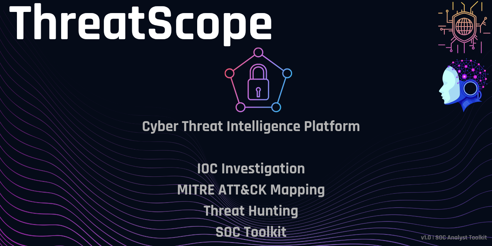

# 🛡️ ThreatScope

  

  Cyber Threat Intelligence Platform built for SOC Analyst investigation workflows.

---

## 🔥 Overview

ThreatScope is a Cyber Threat Intelligence platform designed to simulate real SOC investigation workflows.

The platform helps security analysts investigate Indicators of Compromise (IOCs), analyze Threat Actors, map MITRE ATT&CK techniques, and review security events.

---

# 🚀 Features

## 🔎 IOC Investigation

- Search suspicious IP addresses and indicators
- Identify related threat actors
- View reputation and threat information
- Analyze malicious infrastructure

---

## 🎯 Threat Actor Intelligence

- Threat actor profiles
- Aliases
- Country attribution
- Risk classification
- Malware families
- Campaign timeline

---

## 🧩 MITRE ATT&CK Mapping

- Map adversary behavior to MITRE ATT&CK techniques
- Analyze attacker tactics and techniques
- Connect intelligence findings with attack patterns

---

## 📋 Security Log Analysis

- Windows Event investigation
- Failed login detection
- Suspicious activity analysis
- SOC-style incident review

---

# 📸 Screenshots

## Threat Intelligence Center

---

## Threat Actor Search

---

# 🛠️ Technologies

- Next.js
- React
- TypeScript
- Tailwind CSS
- MITRE ATT&CK Framework
- Cyber Threat Intelligence concepts

---

# 🎯 Project Goals

ThreatScope was created as a SOC Analyst portfolio project to demonstrate practical Blue Team skills:

✔ IOC investigation  
✔ Threat intelligence analysis  
✔ Security dashboard development  
✔ MITRE ATT&CK understanding  
✔ Incident investigation workflow  

---

# 👨‍💻 Author

SOC Analyst | Cyber Security Enthusiast
