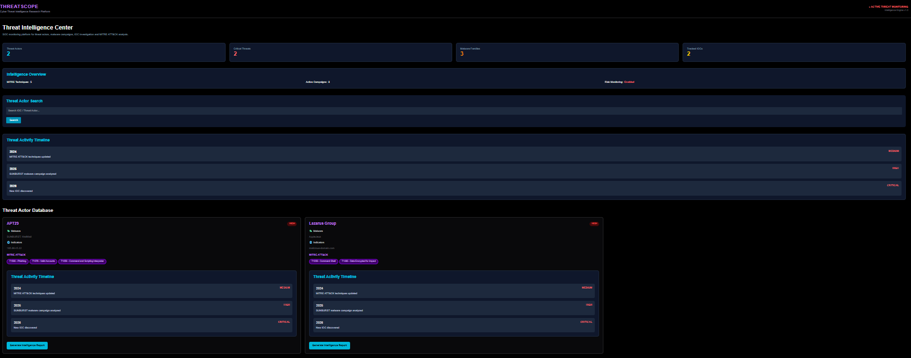
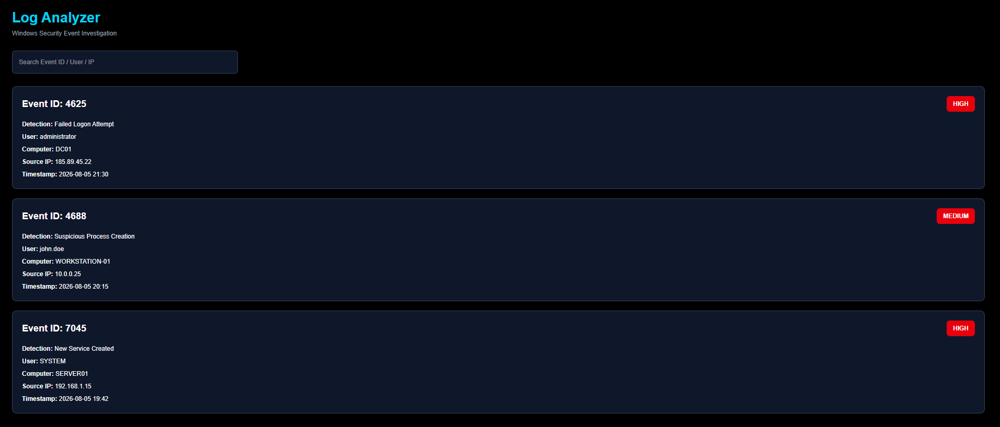
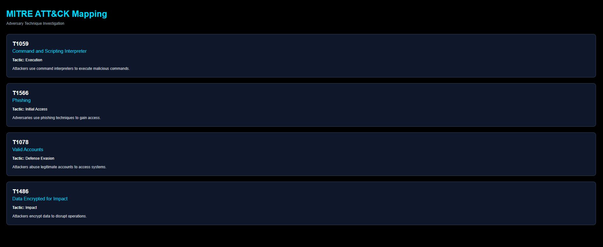
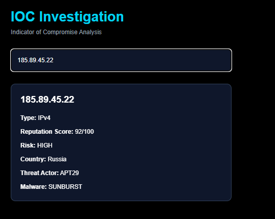

# 🛡️ ThreatScope

Cyber Threat Intelligence & SOC Investigation Platform

ThreatScope is a SOC analyst portfolio project focused on threat intelligence investigation, IOC analysis, MITRE ATT&CK mapping and security event analysis.
---

# 🚀 Features

## 🔎 IOC Investigation

- Threat Actor Investigation
- IOC Reputation Analysis
- MITRE ATT&CK Technique Mapping
- Windows Security Log Analysis

---

## 🎯 Threat Actor Intelligence

- Threat actor profiles
- Aliases
- Risk classification
- Malware families
- Known IOCs
- Campaign timeline

---

## 🧩 MITRE ATT&CK Mapping

- Technique identification
- Adversary behavior analysis
- Attack pattern investigation

---

## 📋 Log Analysis

- Windows Event investigation
- Failed login analysis
- SOC incident investigation workflow

---

# 📸 Screenshots

## Dashboard

## Log analyzing

## MITRE ATT&CK Mapping

## IOC Investigation

---

# 🛠️ Technologies

- Next.js
- React
- TypeScript
- Tailwind CSS
- GitHub

---

## Future Improvements

- VirusTotal API integration
- AbuseIPDB integration
- SIEM integration
- Automated IOC enrichment
- Threat Actor Intelligence
- IOC Investigation
- MITRE ATT&CK Mapping
- Windows Log Analysis
- Cyber Threat Research Dashboard
---

# 🎯 Project Purpose

ThreatScope was created as a SOC Analyst portfolio project demonstrating:

- IOC investigation
- Threat intelligence analysis
- Blue Team workflows
- Security dashboard development
- Incident investigation concepts

---

# 👨‍💻 Author

SOC Analyst | Cyber Security Portfolio Project
