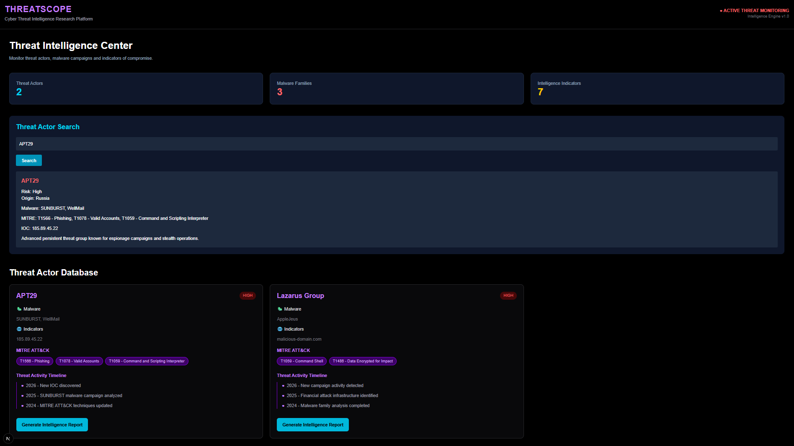

# 🛡️ ThreatScope

Cyber Threat Intelligence Platform built for SOC Analyst investigation workflows.

ThreatScope is a Blue Team security platform for investigating IOCs, Threat Actors, MITRE ATT&CK techniques and security events.

---

# 🚀 Features

## 🔎 IOC Investigation

- Search Indicators of Compromise (IOCs)
- Investigate suspicious IP addresses
- Identify related threat actors
- Analyze threat intelligence data

---

## 🎯 Threat Actor Intelligence

- Threat actor profiles
- Aliases
- Risk classification
- Malware families
- Known IOCs
- Campaign timeline

---

## 🧩 MITRE ATT&CK Mapping

- Technique identification
- Adversary behavior analysis
- Attack pattern investigation

---

## 📋 Log Analysis

- Windows Event investigation
- Failed login analysis
- SOC incident investigation workflow

---

# 📸 Screenshots

---

# 🛠️ Technologies

- Next.js
- React
- TypeScript
- Tailwind CSS
- MITRE ATT&CK Framework

---

# 🎯 Project Purpose

ThreatScope was created as a SOC Analyst portfolio project demonstrating:

- IOC investigation
- Threat intelligence analysis
- Blue Team workflows
- Security dashboard development
- Incident investigation concepts

---

# 👨‍💻 Author

SOC Analyst | Cyber Security Portfolio Project
